# CircuitForge — Phase-Wise Project Roadmap and Architecture

> **CircuitForge**: A visual IoT development environment that translates visual logic blocks into compiled embedded hardware firmware through AI-assisted programming.

---

## 1. System Architecture

CircuitForge follows an isolated multi-tier desktop architecture designed for hardware reliability, strict context isolation, and modular feature expansion:

```text
┌─────────────────────────────────────────────────────────────────────────┐
│                        RENDERER PROCESS (React + TS)                    │
│  ┌───────────────────────┬───────────────────────────────────────────┐  │
│  │ Visual Block Canvas   │ Live Code Generator & Telemetry           │  │
│  │ (Blockly Workspace)   │ (C++/MicroPython Preview, Serial Monitor) │  │
│  └───────────────────────┴───────────────────────────────────────────┘  │
└────────────────────────────────────▲────────────────────────────────────┘
                                     │ IPC Bridge (`window.api`, Context Isolation)
┌────────────────────────────────────▼────────────────────────────────────┐
│                       ELECTRON MAIN PROCESS (Node.js)                   │
│  ┌────────────────────┬────────────────────┬─────────────────────────┐  │
│  │ Serial Manager     │ Compiler Toolchain │ AI Copilot Service      │  │
│  │ (Node `serialport`)│ (`arduino-cli`)    │ (Structured LLM Engine) │  │
│  └────────────────────┴────────────────────┴─────────────────────────┘  │
└────────────────────────────────────▲────────────────────────────────────┘
                                     │ USB Serial / Virtual COM (115200 / 9600 baud)
┌────────────────────────────────────▼────────────────────────────────────┐
│                       PHYSICAL MICROCONTROLLERS                         │
│           (Arduino Uno/Nano, ESP32, ESP8266, RP2040 Raspberry Pi Pico) │
└─────────────────────────────────────────────────────────────────────────┘
```

---

## 2. Phase-Wise Roadmap Overview

```mermaid
graph TD
    subgraph Milestone_0_1 [v0.1: Hardware Link & Serial Core]
        P0[Phase 0: Environment & Desktop Toolchain] --> P1[Phase 1: IPC Serial Bridge & Port Discovery]
        P1 --> P2[Phase 2: Connection Lifecycle & Hardware Status]
        P2 --> P3[Phase 3: Live Serial Monitor & Console]
    end

    subgraph Milestone_0_2 [v0.2: Visual Logic & Block Canvas]
        P3 --> P4[Phase 4: Blockly Engine & Workspace Integration]
        P4 --> P5[Phase 5: IoT & Microcontroller Block Taxonomy]
        P5 --> P6[Phase 6: Real-Time Dual-Pane Code Generator]
    end

    subgraph Milestone_0_3 [v0.3: Compilation & One-Click Flashing]
        P6 --> P7[Phase 7: Headless Embedded Toolchain Integration]
        P7 --> P8[Phase 8: One-Click Compile & Flashing Pipeline]
    end

    subgraph Milestone_0_4 [v0.4: Telemetry & Project Storage]
        P8 --> P9[Phase 9: Real-Time Sensor Telemetry & Graphs]
        P9 --> P10[Phase 10: Project File Format & Starter Library]
    end

    subgraph Milestone_1_0 [v1.0: AI Copilot & Production Release]
        P10 --> P11[Phase 11: Context-Aware Circuit Explainer]
        P11 --> P12[Phase 12: Natural Language to Block Synthesis]
        P12 --> P13[Phase 13: Circuit & Pin Conflict Diagnostics]
        P13 --> P14[Phase 14: Cross-Platform Packaging & Distribution]
    end

    style P0 fill:#2e7d32,stroke:#1b5e20,color:#fff
    style P1 fill:#2e7d32,stroke:#1b5e20,color:#fff
    style P2 fill:#2e7d32,stroke:#1b5e20,color:#fff
    style P3 fill:#2e7d32,stroke:#1b5e20,color:#fff
    style P4 fill:#f57f17,stroke:#e65100,color:#fff
```



---

## 3. Detailed Phase Specifications

### Milestone v0.1 — Hardware Link and Serial Core (Completed)
*Primary Objective: Establish reliable host-to-microcontroller two-way communication, port enumeration, and a live serial console.*

#### Phase 0: Environment and Desktop Toolchain Stabilization
- [x] Stabilize Electron 39 + React 19 + TypeScript + Vite on Windows.
- [x] Configure native build permissions (`@serialport/bindings-cpp`, `esbuild`).
- [x] Enforce PowerShell-safe build scripts (`npm.cmd`).
- [x] Enforce strict process isolation with independent `tsconfig.node.json` and `tsconfig.web.json`.
- **Gate / Definition of Done**: `npm.cmd run build` and `npm.cmd run typecheck` succeed with zero errors.

#### Phase 1: IPC Serial Bridge and Port Discovery
- [x] Implement backend serial enumeration in `src/main/serial.ts` via `SerialPort.list()`.
- [x] Implement IPC handler `serial:list-ports` in `src/main/index.ts`.
- [x] Expose type-safe `listSerialPorts()` via preload `window.api`.
- [x] Establish centralized shared contracts in `src/shared/types.ts`.
- [x] Build Port Selector dropdown in React UI with dynamic refresh button and device vendor metadata.
- **Gate / Definition of Done**: Clicking "Refresh" populates the dropdown with all currently plugged-in USB-to-UART devices on Windows.

#### Phase 2: Connection Lifecycle and Hardware Status Management
- [x] Implement `connectSerialPort()` and `disconnectSerialPort()` in main process with error traps.
- [x] Handle connection status transitions (`disconnected` → `connecting` → `connected` / `error`).
- [x] Stream real-time status updates from main to renderer via `serial:state-change` IPC event.
- [x] Build UI controls: Baud rate selector (`9600`, `19200`, `38400`, `57600`, `115200`, `230400`), Connect/Disconnect toggle button, and monochromatic status badge.
- [x] Handle unexpected device unplugs (auto-cleanup and UI error notification).
- **Gate / Definition of Done**: User can select COM port and baud rate, connect to hardware, see the status change to "Connected", and disconnect cleanly without locking the COM port.

#### Phase 3: Live Serial Monitor and Transmission Console
- [x] Implement data forwarding from `serialport` `data` events to renderer via `serial:data` IPC.
- [x] Implement `serial:write` IPC handler for transmitting data back to the microcontroller.
- [x] Build terminal/console display component in React renderer:
  - Real-time auto-scrolling log with manual scroll-lock option.
  - Line timestamping toggle (`[14:02:11.450]`).
  - Clear buffer button.
  - Transmission input bar with Enter-to-send and line ending options (`No Line Ending`, `Newline \n`, `Carriage Return \r`, `Both \r\n`).
- [x] Monochromatic UI design system with zero emojis and functioning Light/Dark mode toggle.
- **Gate / Definition of Done**: User can receive continuous serial output from a microcontroller and send commands to toggle pins or execute sketches.

---

### Milestone v0.2 — Visual Logic and Block Canvas
*Primary Objective: Provide drag-and-drop visual logic tailored for microcontroller hardware primitives, transpiling live into C++ (Arduino) and MicroPython.*

#### Phase 4: Blockly Engine and Workspace Integration
- [ ] Integrate Google Blockly into React renderer using a clean lifecycle wrapper.
- [ ] Implement responsive dual-pane layout (Resizable Split-view: Block Workspace on left, Code/Monitor on right).
- [ ] Create custom monochromatic technical theme for Blockly canvas and blocks matching the app theme.
- [ ] Implement workspace state serialization (export/import block XML/JSON).
- **Gate / Definition of Done**: Blockly canvas renders smoothly, allows dragging standard logic/math blocks, and scales responsively.

#### Phase 5: IoT and Microcontroller Block Taxonomy
- [ ] **GPIO & Pin Blocks**:
  - `digitalWrite(pin, HIGH/LOW)`
  - `digitalRead(pin)`
  - `analogRead(pin)`
  - `analogWrite(pin, value)` (PWM)
- [ ] **Timing & Control Blocks**:
  - `delay(ms)`
  - `delayMicroseconds(us)`
  - Non-blocking interval timers (`millis()` loop tracking).
- [ ] **Hardware Sensor Blocks**:
  - Ultrasonic Distance Sensor (HC-SR04).
  - Temperature & Humidity (DHT11 / DHT22).
  - Light Sensor (LDR / Analog phototransistor).
  - PIR Motion Sensor.
- [ ] **Actuator & Display Blocks**:
  - Servo motor angle positioning (`0° - 180°`).
  - Relay switch control.
  - Addressable RGB LED (WS2812B NeoPixel).
- **Gate / Definition of Done**: All hardware primitives exist in the Blockly toolbox with accurate pin labels and parameter validation.

#### Phase 6: Real-Time Dual-Pane Code Generator
- [ ] Build custom Blockly code generators:
  - **Arduino C++ Generator**: `setup()` and `loop()` structure, include headers, and pin mode definitions.
  - **MicroPython Generator**: `machine.Pin`, `time.sleep_ms`, and peripheral imports.
- [ ] Implement syntax-highlighted live code preview panel beside the canvas (updates on every block drag/edit).
- [ ] Add one-click "Copy Code" and "Export .ino / .py" buttons.
- [ ] Board profiles selector: Arduino Uno R3/R4, ESP32 DevKit, ESP8266 NodeMCU, Raspberry Pi Pico.
- **Gate / Definition of Done**: Any valid block arrangement instantly produces compilable, idiomatic Arduino C++ or MicroPython code in the preview pane.

---

### Milestone v0.3 — Embedded Compilation and One-Click Flashing
*Primary Objective: Eliminate external IDE requirements by embedding local compilation and firmware flashing directly into CircuitForge.*

#### Phase 7: Headless Embedded Toolchain Integration
- [ ] Integrate bundled `arduino-cli` binary manager in the Electron main process.
- [ ] Implement background core and library indexer:
  - Arduino AVR core (`arduino:avr` for Uno/Nano).
  - ESP32 core (`esp32:esp32` for ESP32 Dev Module).
  - RP2040 core (`rp2040:rp2040` for Pico).
- [ ] Download progress tracking for required toolchain dependencies on first run.
- **Gate / Definition of Done**: `arduino-cli` runs headlessly from the Electron main process and reports installed cores.

#### Phase 8: One-Click Compile and Upload Pipeline
- [ ] Create temporary sketch builder in system cache.
- [ ] Implement `compile` IPC: calls `arduino-cli compile --fqbn <board> <sketchPath>`.
- [ ] Implement `upload` IPC:
  - Temporarily releases the active Serial Monitor port lock.
  - Calls `arduino-cli upload -p <port> --fqbn <board> <sketchPath>`.
  - Automatically re-attaches the Serial Monitor once flashing completes.
- [ ] Beginner-friendly compilation error translator (translates cryptic gcc compiler errors into human explanations).
- **Gate / Definition of Done**: User clicks "Upload", CircuitForge compiles the visual program, flashes it to a connected Arduino/ESP32, and immediately resumes the serial monitor to display running output.

---

### Milestone v0.4 — Sensor Telemetry and Project Management
*Primary Objective: Provide visual instrumentation for sensor data, data logging, and complete project archive persistence.*

#### Phase 9: Real-Time Sensor Telemetry and Visual Dashboard
- [ ] Telemetry Parser: auto-detects structured serial streams (e.g. `KEY:VALUE` or JSON strings like `{"temp":24.5,"hum":60}`).
- [ ] Configurable dashboard visual widgets:
  - Real-time line graph / oscilloscope.
  - Radial dials and gauges.
  - Digital readout cards and binary state indicators (LED simulation).
- [ ] Data logging: Export recorded session telemetry to CSV and JSON files.
- **Gate / Definition of Done**: Microcontroller sending sensor readings over serial automatically plots live curves on the dashboard.

#### Phase 10: Project Storage and Starter Library
- [ ] Standardize `.circuitforge` project file format (JSON bundle containing blocks, board profile, baud rate, and notes).
- [ ] Project File Menu: New, Open, Save, Save As, and Recent Projects list.
- [ ] Built-in Starter Project Library:
  - "Blink & Fade" (Digital/PWM basics)
  - "Smart Obstacle Avoidance" (Ultrasonic + Servo)
  - "Weather Station" (DHT22 + Serial/OLED)
  - "RGB Mood Lamp" (NeoPixel WS2812B)
- **Gate / Definition of Done**: User can save a complete project, close the app, reopen it, and resume work with identical canvas and settings.

---

### Milestone v1.0 — AI Hardware Copilot and Production Release
*Primary Objective: Layer intelligent circuit reasoning, automated block synthesis, and automated cross-platform distribution as the final capstone.*

#### Phase 11: Context-Aware Circuit Explainer
- [ ] Implement Main-process AI provider client with streaming response support.
- [ ] Create Context Extractor: serializes active blocks, pin mappings, and board model into structured prompt context.
- [ ] Build Copilot sidebar in UI:
  - Explains the purpose and runtime flow of the active visual program in plain English.
  - Generates step-by-step breadboard wiring instructions (e.g. "Connect Servo Signal to Pin 9, Red to 5V, Brown to GND").
- **Gate / Definition of Done**: User clicks "Explain Circuit" and receives an accurate, grounded explanation and wiring table corresponding to their active blocks.

#### Phase 12: Natural Language to Block Synthesis
- [ ] Define JSON schema for structured block synthesis (Block types, fields, inputs, and connections).
- [ ] Implement "Prompt-to-Blocks" UI modal:
  - User prompt: e.g. *"When the ultrasonic sensor detects an object closer than 10cm, sound the buzzer on pin 8 and flash the red LED on pin 13."*
  - LLM returns structured block tree.
  - Blockly workspace automatically clears or appends the synthesized blocks.
- **Gate / Definition of Done**: Prompting a common IoT task generates valid, connected blocks in the workspace that immediately transpile to working C++.

#### Phase 13: Circuit and Pin Conflict Diagnostics
- [ ] Implement static hardware rules engine:
  - Detect pin reuse conflicts (e.g. using Pin 0/1 for digital I/O while Serial is active).
  - Detect PWM conflicts on non-PWM pins.
  - Detect voltage mismatches (e.g. 5V sensor outputs connected to 3.3V GPIOs on ESP32 without divider warnings).
- [ ] Inline warning badges in the Blockly workspace highlighting problematic blocks with suggested fixes.
- **Gate / Definition of Done**: Workspace flags conflicting pin configurations before any code is flashed to hardware.

#### Phase 14: Production Packaging and Distribution
- [ ] Configure `electron-builder` for multi-platform distribution:
  - Windows: Portable `.exe` and NSIS installer with desktop shortcut.
  - macOS: `.dmg` (Universal / Apple Silicon & Intel).
  - Linux: `.AppImage` and `.deb`.
- [ ] Set up GitHub Actions automated CI/CD release workflow triggered on version tags.
- [ ] Offline-first packaging (bundles core templates and offline Blockly libraries).
- **Gate / Definition of Done**: Automated release pipeline builds signed/notarized desktop installers ready for student and hobbyist download.

---

## 4. Technical Stack Matrix

| Layer / Subsystem | Primary Technology | Purpose |
| :--- | :--- | :--- |
| **Desktop Shell** | Electron 39+ | Host OS integration, native USB serial, process sandboxing |
| **Frontend Framework** | React 19 + TypeScript | Component-driven, responsive desktop UI |
| **Build & Bundler** | electron-vite 5+ (Vite 7) | Lightning-fast HMR and optimized three-bundle build |
| **Hardware Communication** | Node `serialport` v13 | Low-level cross-platform COM port enumeration & I/O |
| **Visual Block Engine** | Google Blockly | Drag-and-drop programming canvas and AST |
| **Code Generation** | Custom Blockly Generators | Transpiling visual blocks to Arduino C++ & MicroPython |
| **Embedded Toolchain** | `arduino-cli` | Headless board compilation and firmware flashing |
| **AI Copilot** | Structured LLM Engine | Natural language synthesis, circuit explanation, conflict auditing |
| **UI Design System** | Monochromatic Vanilla CSS | Minimalist, high-contrast dark and light engineering theme |

---

## 5. Development Principles and Engineering Rules

1. **Hardware-First Completeness**:
   The entire functional loop—from visual blocks to compilation, serial flashing, and telemetry—must be completely operational offline before the AI Copilot layer is introduced.
2. **Strict Hardware Sandboxing**:
   The React renderer must never import Node.js or Electron modules directly. All hardware interactions pass through strongly-typed IPC APIs in `preload/index.ts` and `shared/types.ts`.
3. **Deterministic Flashing & Serial Locking**:
   On Windows, a COM port can only be accessed by one process at a time. The serial monitor must always safely pause and release the COM port handle before invoking `arduino-cli upload`, and automatically reacquire the port after flashing terminates.
4. **Incremental Verification**:
   No phase begins before the preceding phase satisfies its definition of done.
